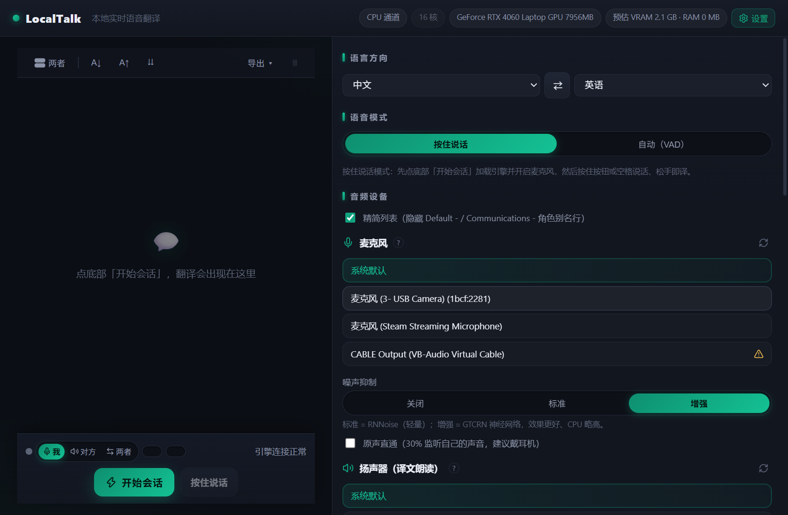

# LocalTalk — 本地实时语音翻译桌面应用

> **100% offline real-time speech translation on your own machine.**
> Electron + React frontend, Python sidecar inference (ASR → LLM translation → TTS, all
> local ggml/GPU via Vulkan). Ported from [Sokuji](https://github.com/kizuna-ai-lab/sokuji)'s
> open-source local-inference stack (AGPL-3.0). No cloud AI API is ever called —
> the only network traffic is the one-time model download from HuggingFace.


<!-- 放一张主界面截图：左侧设置面板 + 中间对话流。没有截图前删掉这行。 -->

## 它能做什么

戴上耳机开会/上课/看生肉，它把你的**中文语音实时变成你选定语言的语音+字幕**，全程断网可用：

- 🎙 **两种拾取模式**：**按住说话**（PTT，松手即出结果）/ **自动断句**（Silero VAD，
  说完停顿自动出，适合连续对话，阈值/判停/最短语音可调）
- 🧑‍🤝‍🧑 **三种通道**：**我**（翻译自己）/ **对方**（采集一个系统音频源，反方向翻译，
  如会议里对方的声音）/ **两者**（双引擎进程并行，双向互译）
- 🗣 **音色克隆**：录 3~20 秒你的声音，译文就用你的声音朗读（MOSS-TTS-Nano /
  VoxCPM 等免文字稿；Qwen3-TTS / OmniVoice 克隆制需转写）；每段音色可原声回放、
  独立试听（不需要开始会话）
- 🔇 **三档降噪**：关闭 / RNNoise 标准 / GTCRN 神经网络增强（失败自动降级），
  外加 30% **原声直通**监听（建议戴耳机）
- 📜 **对话流**：原文/译文四态显示、字号、折叠、txt/json 导出、一键清空
- 📦 **模型管理**：应用内浏览 catalog、一键下载（走 HuggingFace）、逐个删除、
  预估/实测显存展示、"释放引擎显存"即时卸载
- ⚙️ 每个语言方向**独立记忆**自己的 ASR/翻译/TTS 三段模型与音色

## 系统要求

| | 最低 | 推荐 |
|---|---|---|
| 系统 | Windows 10/11 x64 | 同左（Linux/macOS 需换 wheel，见 sidecar 说明） |
| GPU | 任意 Vulkan 可用（N/A/I 卡），纯 CPU 也能跑（慢） | ≥6GB 显存的独显（本项目实测 RTX 4060 Laptop） |
| 软件 | Node.js ≥ 20；Python 3.11/3.12（或 Miniconda/Miniforge） | conda |
| 磁盘 | ~4 GB（三个模型） | ~10 GB（多试几个模型） |

## 快速开始

```powershell
# 1) sidecar Python 环境（二选一）
cd sidecar
powershell -ExecutionPolicy Bypass -File .\setup-conda.ps1   # 有 conda：建专用环境 localtalk
# .\setup.ps1                                                # 无 conda：普通 venv（需系统 Python 3.11/3.12）

# 2) 桌面应用
cd ..\app
npm install
npm run dev        # vite + 自动拉起 Electron 窗口
```

3) 窗口打开后，在右侧面板给 ASR / 翻译 / TTS 各点一次**下载模型**（每个几百 MB~2GB，
   存到 `%APPDATA%\localtalk\hf-cache`），下载完点底部**开始会话**即可开说。

> **中国大陆网络**：模型下载先设 `$env:HF_ENDPOINT='https://hf-mirror.com'` 再启动应用；
> npm 用 `--registry=https://registry.npmmirror.com` 并设
> `$env:ELECTRON_MIRROR='https://npmmirror.com/mirrors/electron/'`。
> 装完后残留的 `HTTP(S)_PROXY=127.0.0.1:xxxx` 而代理没开会让你 `ECONNREFUSED`，清掉即可。

## 使用速览

1. **语言方向**：源/目标 + ⇄ 互换；每个方向记住自己的三段模型
2. **点「开始会话」**（首次加载模型 10~60s）→ 麦克风常开
3. **按住说话**（或空格），松手 → 原文行 + 译文行 → 自动朗读
   自动模式则说完停顿 ~1.4s 即出
4. 想听自己的声音：语音合成设置 → **录一段 3~20s** → 选中 → 「试听」

更多（VAD 调参原则、通道模式、克隆细节、导出、精简设备列表…）见
[docs/USAGE.md](docs/USAGE.md) 与界面内联帮助（? 气泡）。

## 架构一图流

```
┌─ Electron (Chromium) ─────────────────────────┐      ┌─ Python sidecar ×2 lane ─────────────┐
│ 麦克风 → AudioWorklet 重采样 → Silero VAD     │ WS   │ sokuji_sidecar（Sokuji 原样移植）     │
│ getUserMedia → RNNoise/GTCRN 降噪 → Int16@24k ├──────┤ sokuji_native wheel（ggml, Vulkan）   │
│ 译文 → TTS 流式 PCM 播放 / 对话流 / 导出       │ PCM  │  transcribe.cpp·ASR ─ llama.cpp·翻译  │
└───────────────────────────────────────────────┘      │  ─ audio.cpp·TTS（9 家族）            │
        模型选择/下载/RPC：src/lib/native/*  ──────────►└───────────────────────────────────────┘
```

目录结构、WS-RPC 协议、VAD/分段设计、显存规划——细节全部写在
[docs/DEVELOPMENT.md](docs/DEVELOPMENT.md)。

## 数据都存在哪

| 内容 | 位置 |
|---|---|
| 模型权重（HF cache） | `%APPDATA%\localtalk\hf-cache\hub\` |
| 克隆音色（录音） | `%APPDATA%\localtalk\IndexedDB\`（`localtalk-native-voices`） |
| 全部设置 | 同目录 localStorage（`localtalk-config`） |
| Python 环境 | conda env `localtalk`（或 `sidecar/.venv`） |

应用完全离线运行；删掉以上目录即彻底清数据。

## 常见问题

| 症状 | 处理 |
|---|---|
| 启动报 `sidecar exited before handshake` | 第 1 步环境没装好。手验：`& (Get-Content sidecar\.python-path) -m sokuji_sidecar`（cwd=sidecar），应打印 `{"port": …}` |
| 识别一直空 | 所选 ASR 卡的 `languages` 必须包含你的源语言；或源语言设「自动/多语」。再看 Windows 麦克风权限 |
| 识别慢 | Qwen3-ASR 实测 4× 慢于实时；换 Cohere Transcribe 或 SenseVoice 类小卡 |
| 结果被切碎、准确率低 | VAD 判停别低于 1.0s（默认 1.4s）；离线 ASR 无中间结果，短句缺上下文 |
| 译文语言不对 | 检查底部方向标签（zh → xx）——每个方向独立记配置 |
| TTS 没声音 | 该家族需要音色（克隆制模型）；换 MOSS-TTS-Nano / Supertonic 等免音色家族 |
| 模型下载失败/慢 | 见上面「中国大陆网络」的 `HF_ENDPOINT` 镜像 |

## 许可证与出处（重要）

- 本项目基于 [Sokuji](https://github.com/kizuna-ai-lab/sokuji)（**AGPL-3.0**，© Kizuna AI Lab）
  的本地推理链路移植：`sidecar/sokuji_sidecar/` 原样复制，`app/src/lib/native/`、
  VAD/降噪 worker、`electron/sidecar-host.js` 等为移植/改写——相关文件头部均保留出处注释。
- 因此**整个项目以 AGPL-3.0 发布**（见 [LICENSE](LICENSE)）。你可以自由使用、修改；
  一旦**分发**修改版或提供网络服务，必须以 AGPL-3.0 开源完整对应源码。
- `sokuji_native` 引擎以 Sokuji 官方 GitHub Releases 发布的预编译 wheel 安装
  （`sidecar/requirements.txt` 按平台 pin 了 URL），无需本地编译 C++。
- 模型权重各随其上游许可证（Qwen / Hunyuan / Cohere / Supertonic 等），由你在
  应用内下载时遵循各模型页条款。

本项目与 Sokuji 官方无关，是个人本地化改造；欢迎提 Issue，但请按「爱用者自助」心态对待。

## Acknowledgements

[Sokuji / kizuna-ai-lab](https://github.com/kizuna-ai-lab/sokuji) ·
[ggml / llama.cpp](https://github.com/ggml-org/llama.cpp) ·
[transcribe.cpp](https://github.com/xxr141/transcribe) ·
[audio.cpp](https://github.com/DrDoughnut/audio.cpp) ·
[Silero VAD](https://github.com/snakers4/silero-vad) ·
[GTCRN](https://github.com/xfvoice/GTCRN) · RNNoise ·
onnxruntime-web · Electron · React · zustand

## Disclaimer

个人项目，无 SLA。翻译/语音模型输出质量因机型与显存档位差异较大，重要场合请人工复核。
